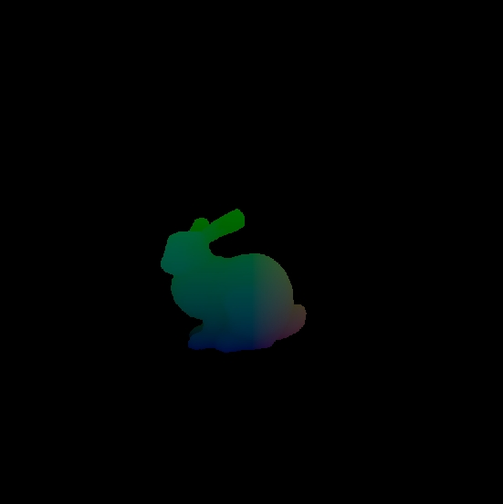

# A Python Ray-Mesh Intersector in Slangpy 

this is a GPU LBVH builder implemented in [slang-torch](https://github.com/shader-slang/slang-torch), based on [Vulkan LBVH (Linear Bounding Volume Hierarchy)](https://github.com/MircoWerner/VkLBVH)

I build every step in slangpy, so you can get any buffers in the BVH building process, for example, you can get the information of the bvh trees, so you can query on them in your own kernel, or do anything to them.
## Installation

```
pip install torch, pyexr, slangpy, time, csv, numpy
```

## Usage

run ```test.py```, which will let you know every step of building it.
and you will get a position map of a bunny.


### performance
simply querying the trees in kernel helps a lot, to get the position map of the bunny above, I compared with [Triro](https://github.com/lcp29/trimesh-ray-optix), which uses **NVIDIA OptiX** to find intersections 

```
GPU ray query time(test on RTX4090):
Triro : 0.015184 s
mine: 0.001178s
```
